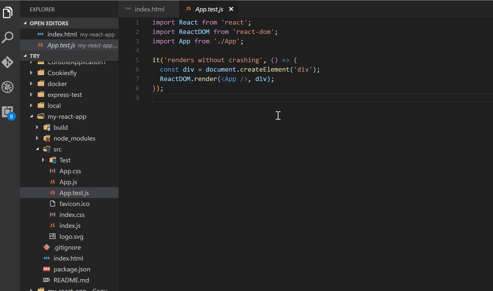
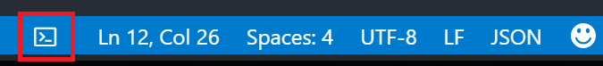

# Terminal

Run terminal command directly in Text Editor

## Notice
From v0.0.4, this extension will have limited updates for bug fix or feature development, because:

1. I have another extension: [Code Runner](https://marketplace.visualstudio.com/items?itemName=formulahendry.code-runner) which is superset of the Terminal extension since it not only supports `powershell, bat/cmd, bash/sh` but also supports other script language like `js, php, python, perl, ruby, go, lua, groovy, vbscript` even `F#, C#`. Moreover, this Code Runner extension has more functions (e.g. working directory support, output syntax highlight, run as a file instead of running a set of commands and so on) and will have more supports and updates in the future.

2. VS Code already has basic built-in support for the terminal from v1.2 and add 'run selected text' in v1.3. Besides, the ability to run the entire text of current active text editor will come in v1.5. I have already sent the [Pull request](https://github.com/Microsoft/vscode/pull/9480) and it has been merged.

## Features

* Run all the commands in Text Editor
* Run the selected commands in Text Editor
* Stop the running commands
* View output in Output Window
* Open Integrated Terminal at current file's directory
* Quick way to toggle Integrated Terminal

## Usages

* Write or select a set of commands in Text Editor, then use shortcut `Ctrl+Alt+R`, or press `F1` and then select/type `Run Terminal Command`, the commands will run and the output will be shown in the Output Window.
* To stop the running commands, use shortcut `Ctrl+Alt+C`, or press `F1` and then select/type `Stop Terminal Command`


* To open Integrated Terminal at current file's directory, use shortcut `Ctrl+Alt+O`, or press `F1` and then select/type `Open in Integrated Terminal`, or right click in Text Editor/Explorer and then click `Open in Integrated Terminal` in context menu



* To toggle Integrated Terminal, use shortcut `Ctrl+Alt+T`, or click the `Terminal` icon in the Status Bar at the bottom



## Telemetry data
By default, telemetry data collection is turned on. To disable it, update the settings.json as below:
```json
{
    "terminal.enableAppInsights": false
}
```

## Change Log
### 0.0.8 (2017-05-15)
* Quick way to toggle Integrated Terminal in the Status Bar

### 0.0.7
* Add 'Open in Integrated Terminal' context menu

### 0.0.6
* Upgrade applicationinsights npm since [telemetry data requires HTTPS](https://azure.microsoft.com/en-us/updates/application-insights-telemetry-data-now-requires-https-with-shutdown-of-http-data-collectors/)

### 0.0.5
* Add Application Insights to track telemetry data

### 0.0.4
* Update the future of this extension

### 0.0.3
* Add support to stop running commands

### 0.0.2
* Update README.md and add GitHub info

### 0.0.1
* Initial Release

## Issues
Submit the [issues](https://github.com/formulahendry/vscode-terminal/issues) if you find any bug or have any suggestion.

## Contribution
Fork the [repo](https://github.com/formulahendry/vscode-terminal) and submit pull requests.